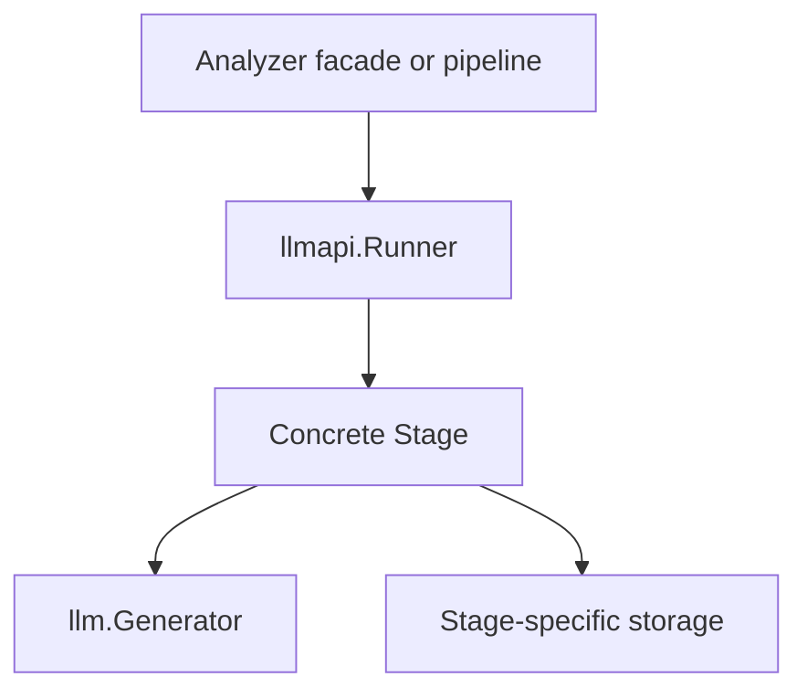

# Prism LLM Runner and Stage Construction Guide

Status: implementation guide  
Codebase reviewed: 2026-07-31  
Target package: `internal/analyzer/llmapi`

## 1. Purpose

This guide defines how to build and test the reusable LLM `Runner` and concrete
Analyzer `Stage` implementations in Prism.

The abstraction is intentionally narrow:

> A Runner standardizes one Analyzer LLM round trip. It is not a worker
> service, message consumer, task lifecycle manager, or general-purpose
> workflow engine.

Every Runner execution has exactly three lifecycle steps:

```text
PreProcess -> APICall -> PostProcess
```

- `Runner` owns the fixed order, tracing, and boundary logging.
- `Stage` owns the behavior of all three steps and the dependencies required to
  perform them.
- `Packet` owns mutable state for one execution only.

The current codebase already provides the LLM contract that every Stage must
use:

```go
// internal/llm/llm.go
type Generator interface {
	Generate(
		ctx context.Context,
		req *GenerateRequest,
	) (*GenerateResponse, error)
}
```

Do not add a duplicate `LLMClient` interface to `llmapi`.

## 2. Codebase Baseline

The design in this guide is based on the following existing Prism behavior.

### 2.1 Existing Analyzer implementations

`internal/analyzer/extractor.Extractor` and
`internal/analyzer/scorer.Scorer` currently perform request preparation, the
LLM call, and response processing inside one public method:

```text
ExtractTopic / ScoreStance
  -> validate and marshal input
  -> construct llm.GenerateRequest
  -> generator.Generate
  -> DecodeJSONSchema
  -> domain validation
```

These two packages are the first migration targets for the Runner/Stage
structure. They already have focused unit tests using
`internal/llm/mocks.MockGenerator`.

Neither package is currently wired into an Analyzer worker command. The
existing `cmd/worker/analyzer/embedder` uses `llm.Embedder` and has a different
lifecycle; it should not be forced into this generation Runner.

### 2.2 Existing LLM infrastructure

- `internal/llm.Generator` is the required generation dependency.
- `llm.GenerateRequest` and `llm.GenerateResponse` are the shared request and
  response types.
- `(*llm.GenerateResponse).DecodeJSONSchema` is the shared structured-output
  decoder.
- `llmfactory.NewGenerator` already returns a provider wrapped with
  `llm.InstrumentGenerator` through `InstrumentProvider`.
- Existing LLM instrumentation records request counts, duration, outcome, and
  token usage.

The Runner must therefore add lifecycle-level spans and logs, but must not
duplicate provider/model token metrics.

### 2.3 Existing observability conventions

- Obtain a tracer from `obs.Telemetry` in the composition root.
- Call `infra.SetTracer(tracer)` before constructing the LLM provider so its
  downstream HTTP/provider spans use the same tracer provider.
- Pass `trace.Tracer` into constructors. Do not create a package-global tracer.
- Use the logger built by `obs.NewLoggerFromHandlers`.
- Use `ErrorContext`, `WarnContext`, and `InfoContext` so the existing
  `obs.TraceIDHook` can add the active trace ID.

### 2.4 Existing repository and test conventions

- Each package uses an `ErrParamMissing` sentinel for missing constructor
  dependencies.
- Wrap errors with `%w` so `errors.Is` continues to work.
- Testify `require` and generated Mockery mocks are already used.
- Mockery configuration is stored in `.mockery.yaml`; run `task mocks` after
  adding an interface that requires a generated mock.
- The normal unit-test command is:

  ```bash
  go test -v -short -cover ./...
  ```

The current `repo.Analysis` contract persists content extractions, but it does
not yet define storage for every planned topic-framework or stance-scoring
result. Do not invent a broad storage interface in `llmapi`. Add a narrow
storage contract inside a concrete Stage package only when its database
contract exists.

## 3. Responsibility Boundaries



### 3.1 Runner

The Runner owns:

- the fixed `PreProcess -> APICall -> PostProcess` order;
- a parent span for the complete Stage execution;
- one child span for each lifecycle step;
- step error wrapping;
- recording errors on spans;
- one structured error log at the Runner boundary.

The Runner must not own:

- `llm.Generator`;
- PostgreSQL, Valkey, S3, or repository dependencies;
- prompts, schemas, models, or domain validation;
- NATS subscription, Ack/Nack, task completion, or retry policy;
- branches based on a concrete Stage name;
- token or provider request metrics already recorded by `internal/llm`.

### 3.2 Stage

A concrete Stage owns:

- its `llm.Generator`;
- its model, prompt, JSON Schema, and generation settings;
- any Stage-specific DB, KeyVal, object-storage, or HTTP dependencies;
- input validation and request construction;
- the actual `Generator.Generate` call;
- response decoding and domain validation;
- durable writes required by that Stage.

A Stage must not:

- change the three-step order;
- create its own top-level Runner span;
- log the same terminal error that the Runner will log;
- store execution-specific mutable state in Stage fields;
- start an independent retry loop;
- handle message delivery or task status transitions.

The same Stage instance may be used concurrently. Its fields must therefore be
immutable configuration or concurrency-safe dependencies.

### 3.3 Packet

A Packet belongs to one call to `Runner.Do`.

It may contain:

- immutable domain input;
- Stage-specific working state;
- one `llm.GenerateRequest`;
- one `llm.GenerateResponse`;
- the typed domain output.

It must not contain:

- a generator, repository, logger, or tracer;
- an Ack/Nack handle;
- an open DB transaction crossing lifecycle steps;
- state reused by another execution or retry.

The caller must create a new Packet for every attempt.

## 4. Package Layout

Add the shared lifecycle package:

```text
internal/analyzer/llmapi/
├── packet.go
├── runner.go
├── runner_test.go
└── stage.go
```

Keep concrete Stages under semantic package names:

```text
internal/analyzer/
├── llmapi/
├── extractor/
│   ├── extractor.go        # analyzer.TopicExtractor facade
│   ├── stage.go            # concrete llmapi.Stage
│   ├── schema.go
│   ├── extractor_test.go
│   └── stage_test.go
└── scorer/
    ├── scorer.go           # analyzer.StanceScorer facade
    ├── stage.go            # concrete llmapi.Stage
    ├── schema.go
    ├── scorer_test.go
    └── stage_test.go
```

Do not use directory names such as `stage_1` or `stage_2`. Pipeline position is
assembly information, not Stage identity. If new packages are introduced,
prefer names such as `extraction`, `framework`, and `evaluation`.

## 5. Shared Contracts

### 5.1 Packet

Use generics to preserve concrete input, state, and output types without
`map[string]any`, type assertions, or a service-locator-style runtime.

```go
package llmapi

import "github.com/ChiaYuChang/prism/internal/llm"

type Packet[I, S, O any] struct {
	input I

	State    S
	Request  *llm.GenerateRequest
	Response *llm.GenerateResponse
	Output   O
}

func NewPacket[I, S, O any](input I) *Packet[I, S, O] {
	return &Packet[I, S, O]{input: input}
}

func (p *Packet[I, S, O]) Input() I {
	return p.input
}
```

`input` is unexported so the Runner and Stage cannot accidentally replace it.
The Stage can still read it through `Input()`.

Do not add getters and setters for every field. `State`, `Request`, `Response`,
and `Output` are intentionally writable working data for the concrete Stage.

### 5.2 Stage

```go
package llmapi

import "context"

type Stage[I, S, O any] interface {
	Name() string

	PreProcess(context.Context, *Packet[I, S, O]) error
	APICall(context.Context, *Packet[I, S, O]) error
	PostProcess(context.Context, *Packet[I, S, O]) error
}
```

Use stable semantic names:

```go
const StageName = "topic_extraction"

func (*Stage) Name() string {
	return StageName
}
```

Do not include a sequence number in `Name()`. It is used by logs and traces and
must remain stable if pipeline order changes.

### 5.3 Step names

Centralize the three names to prevent telemetry drift:

```go
package llmapi

type Step string

const (
	StepPreProcess  Step = "pre_process"
	StepAPICall     Step = "api_call"
	StepPostProcess Step = "post_process"
)
```

## 6. Runner Implementation

### 6.1 Structure and constructor

```go
package llmapi

import (
	"errors"
	"fmt"
	"log/slog"

	"go.opentelemetry.io/otel/trace"
)

var (
	ErrParamMissing = errors.New("param missing")
	ErrNilPacket    = errors.New("packet is nil")
)

type Runner[I, S, O any] struct {
	tracer trace.Tracer
	logger *slog.Logger
	stage  Stage[I, S, O]
}

func NewRunner[I, S, O any](
	tracer trace.Tracer,
	logger *slog.Logger,
	stage Stage[I, S, O],
) (*Runner[I, S, O], error) {
	if tracer == nil {
		return nil, fmt.Errorf("%w: tracer", ErrParamMissing)
	}
	if logger == nil {
		return nil, fmt.Errorf("%w: logger", ErrParamMissing)
	}
	if stage == nil {
		return nil, fmt.Errorf("%w: stage", ErrParamMissing)
	}
	if stage.Name() == "" {
		return nil, fmt.Errorf("%w: stage name", ErrParamMissing)
	}

	return &Runner[I, S, O]{
		tracer: tracer,
		logger: logger.With(
			slog.String("component", "analyzer.llmapi.runner"),
			slog.String("stage", stage.Name()),
		),
		stage: stage,
	}, nil
}
```

Follow the repository convention and keep one `ErrParamMissing` sentinel in
the `llmapi` package.

### 6.2 `Do`

`Do` must show the lifecycle explicitly. Do not replace it with a dynamic slice
of functions.

```go
package llmapi

import (
	"context"
	"fmt"
	"log/slog"

	"go.opentelemetry.io/otel/attribute"
	"go.opentelemetry.io/otel/codes"
	"go.opentelemetry.io/otel/trace"
)

func (r *Runner[I, S, O]) Do(
	ctx context.Context,
	p *Packet[I, S, O],
) (err error) {
	ctx, span := r.tracer.Start(
		ctx,
		"analyzer.llmapi."+r.stage.Name(),
		trace.WithSpanKind(trace.SpanKindInternal),
		trace.WithAttributes(
			attribute.String("analyzer.stage", r.stage.Name()),
		),
	)
	defer func() {
		if err != nil {
			span.RecordError(err)
			span.SetStatus(codes.Error, err.Error())
			r.logger.ErrorContext(
				ctx,
				"LLM stage failed",
				slog.Any("error", err),
			)
		}
		span.End()
	}()

	if p == nil {
		return ErrNilPacket
	}

	if err = r.step(ctx, StepPreProcess, func(stepCtx context.Context) error {
		return r.stage.PreProcess(stepCtx, p)
	}); err != nil {
		return err
	}

	if err = r.step(ctx, StepAPICall, func(stepCtx context.Context) error {
		return r.stage.APICall(stepCtx, p)
	}); err != nil {
		return err
	}

	if err = r.step(ctx, StepPostProcess, func(stepCtx context.Context) error {
		return r.stage.PostProcess(stepCtx, p)
	}); err != nil {
		return err
	}

	return nil
}

func (r *Runner[I, S, O]) step(
	ctx context.Context,
	step Step,
	fn func(context.Context) error,
) (err error) {
	ctx, span := r.tracer.Start(
		ctx,
		string(step),
		trace.WithSpanKind(trace.SpanKindInternal),
		trace.WithAttributes(
			attribute.String("analyzer.stage", r.stage.Name()),
			attribute.String("analyzer.step", string(step)),
		),
	)
	defer func() {
		if err != nil {
			span.RecordError(err)
			span.SetStatus(codes.Error, err.Error())
		}
		span.End()
	}()

	if err = fn(ctx); err != nil {
		return fmt.Errorf("%s: %w", step, err)
	}
	return nil
}
```

The expected span tree is:

```text
analyzer.llmapi.<stage_name>
├── pre_process
├── api_call
│   └── provider / HTTP spans
└── post_process
    └── repository / Valkey spans
```

The helper `step` exists only to remove repeated span start/error/end code. It
must not implement retry, mutate the Packet, or make decisions based on the
step name.

### 6.3 Logging rules

- Log the terminal failure once in `Runner.Do`.
- Do not log each successful step; spans already contain duration and success.
- Child steps record errors on spans but do not emit duplicate error logs.
- A concrete Stage may log meaningful domain events, such as a fallback or
  idempotent no-op, but should not log every method entry and exit.
- Never log full prompts, article bodies, raw LLM responses, API keys, or other
  sensitive payloads.
- Do not use task IDs, candidate IDs, or trace IDs as metric labels. They may be
  span attributes or structured log fields when operationally necessary.

## 7. Constructing a Concrete Stage

Use the following order for each Stage.

### Step 1: Define typed execution data

Keep domain input and output in `internal/analyzer` when they are shared public
contracts. Keep working state private to the concrete Stage package.

```go
type state struct {
	// Intermediate values that are not part of the public domain result.
}

type packet = llmapi.Packet[
	*analyzer.TopicExtractionInput,
	state,
	*analyzer.TopicExtractionOutput,
]
```

Use a pointer output when absence must be distinguishable from a valid zero
value.

### Step 2: Define only the storage capability the Stage uses

If persistence is required, define a narrow interface in the concrete Stage
package:

```go
type Store interface {
	SaveTopicExtraction(
		context.Context,
		SaveTopicExtractionParams,
	) error
}
```

Do not place Stage storage methods in `llmapi`, and do not inject the complete
`repo.Repository` when the Stage uses only one or two operations.

For current Analyzer outputs whose database schema does not yet exist, first
finish the schema/query/repository contract. Do not create a fake generic
`Save(any)` abstraction merely to complete the Stage constructor.

### Step 3: Construct the Stage

```go
type Stage struct {
	generator llm.Generator
	store     Store // omit only when this Stage has no durable-write contract
	model     string
	prompt    string
}

func NewStage(
	generator llm.Generator,
	store Store,
	model string,
	prompt string,
) (*Stage, error) {
	if generator == nil {
		return nil, fmt.Errorf("%w: generator", ErrParamMissing)
	}
	if store == nil {
		return nil, fmt.Errorf("%w: store", ErrParamMissing)
	}
	if strings.TrimSpace(model) == "" {
		return nil, fmt.Errorf("%w: model", ErrParamMissing)
	}
	if strings.TrimSpace(prompt) == "" {
		return nil, fmt.Errorf("%w: prompt", ErrParamMissing)
	}

	return &Stage{
		generator: generator,
		store:     store,
		model:     model,
		prompt:    prompt,
	}, nil
}
```

The Stage normally does not need the Runner tracer or logger. Inject a logger
into a Stage only if it emits distinct domain events.

### Step 4: Implement `PreProcess`

`PreProcess` validates the typed input and creates a complete
`llm.GenerateRequest`.

For the current topic extractor, it includes:

- rejecting nil input or an empty article collection;
- marshaling the article input;
- selecting the configured model and prompt;
- setting temperature;
- selecting `llm.ResponseFormatJsonSchema`;
- attaching `TopicExtractionResultJSONSchema`.

```go
func (s *Stage) PreProcess(ctx context.Context, p *packet) error {
	in := p.Input()
	if in == nil || len(in.Articles) == 0 {
		return ErrNilInput
	}

	content, err := json.Marshal(in.Articles)
	if err != nil {
		return fmt.Errorf("marshal articles input: %w", err)
	}

	p.Request = &llm.GenerateRequest{
		Model:             s.model,
		SystemInstruction: s.prompt,
		Prompt:            string(content),
		Temperature:       utils.Ptr(float32(0.2)),
		Format:            llm.ResponseFormatJsonSchema,
		JSONSchema:        TopicExtractionResultJSONSchema,
	}
	return nil
}
```

`PreProcess` must not call the generator or persist the final result.

### Step 5: Implement `APICall`

`APICall` owns the Stage's generator call:

```go
var ErrRequestMissing = errors.New("generate request is missing")

func (s *Stage) APICall(ctx context.Context, p *packet) error {
	if p.Request == nil {
		return ErrRequestMissing
	}

	resp, err := s.generator.Generate(ctx, p.Request)
	if err != nil {
		return fmt.Errorf("generate topic extraction: %w", err)
	}
	if resp == nil {
		return llm.ErrNilGenerateResponse
	}

	p.Response = resp
	return nil
}
```

The generator belongs to the Stage for the same reason storage does: different
Stages may use different providers, models, timeouts, or adapters.

If NATS is later used as the transport for generation, implement an adapter
that satisfies `llm.Generator` and inject it here. Do not expose a `NATSClient`
field on the Runner.

### Step 6: Implement `PostProcess`

`PostProcess` converts and validates the response, performs any Stage-owned
durable write, and sets the typed output.

For the current topic extractor:

```go
var ErrResponseMissing = errors.New("generate response is missing")

func (s *Stage) PostProcess(ctx context.Context, p *packet) error {
	if p.Response == nil {
		return ErrResponseMissing
	}

	var out analyzer.TopicExtractionOutput
	if err := p.Response.DecodeJSONSchema(&out); err != nil {
		return fmt.Errorf("%w: %w", ErrFailedToDecodeOutput, err)
	}

	out.Issues = analyzer.AssignIssueIDs(out.Issues)

	// Persist here when this Stage has a defined repository contract.
	// The write must be idempotent for task/message redelivery.

	p.Output = &out
	return nil
}
```

For stance scoring, this step must also run
`analyzer.ValidateStanceScore` for every score before storing or exposing the
output.

When persistence is required:

1. decode;
2. validate and normalize;
3. write idempotently;
4. assign `p.Output`;
5. return success.

Do not make an invalid result visible as a successful output.

### Step 7: Add a compile-time interface check

```go
var _ llmapi.Stage[
	*analyzer.TopicExtractionInput,
	state,
	*analyzer.TopicExtractionOutput,
] = (*Stage)(nil)
```

## 8. Preserving the Existing Analyzer Interfaces

The shared Runner does not need to replace the current
`analyzer.TopicExtractor` and `analyzer.StanceScorer` interfaces.

Keep a small facade that translates the existing method into a Packet
execution:

```go
type Extractor struct {
	runner *llmapi.Runner[
		*analyzer.TopicExtractionInput,
		state,
		*analyzer.TopicExtractionOutput,
	]
}

func (e *Extractor) ExtractTopic(
	ctx context.Context,
	in *analyzer.TopicExtractionInput,
) (*analyzer.TopicExtractionOutput, error) {
	p := llmapi.NewPacket[
		*analyzer.TopicExtractionInput,
		state,
		*analyzer.TopicExtractionOutput,
	](in)

	if err := e.runner.Do(ctx, p); err != nil {
		return nil, err
	}
	if p.Output == nil {
		return nil, ErrMissingOutput
	}
	return p.Output, nil
}
```

This preserves the public Analyzer boundary while moving the repeated LLM
round-trip lifecycle into `llmapi.Runner`.

## 9. Composition Flow

Construct dependencies from the outside inward:

```text
config and telemetry
-> repository and prompt storage
-> llmfactory.NewGenerator
-> concrete Stage
-> llmapi.Runner
-> Analyzer facade
-> Analyzer pipeline
-> worker handler
```

Conceptual wiring:

```go
tracer := telemetry.Tracer("prism.worker.analyzer")
infra.SetTracer(tracer)

generator, err := llmfactory.NewGenerator(ctx, cfg.LLM, logger)
if err != nil {
	return err
}

stage, err := extractor.NewStage(
	generator,
	extractionStore,
	cfg.LLM.Model,
	promptBody,
)
if err != nil {
	return err
}

runner, err := llmapi.NewRunner(tracer, logger, stage)
if err != nil {
	return err
}

topicExtractor, err := extractor.New(runner)
if err != nil {
	return err
}
```

The worker handler remains responsible for message decoding, task ownership,
task Complete/Fail transitions, and Ack/Nack. It calls the Analyzer facade; it
does not call `PreProcess`, `APICall`, or `PostProcess` directly.

## 10. Migration Plan

Implement the change in small, reviewable slices.

### Slice 1: Add and test `llmapi`

- Add `Packet`, `Step`, `Stage`, and `Runner`.
- Add Runner constructor, sequencing, error, trace, and log tests.
- Do not modify existing Analyzer behavior yet.

### Slice 2: Migrate topic extraction

- Split current `internal/analyzer/extractor.Extractor` behavior across the
  three Stage methods.
- Preserve `analyzer.TopicExtractor`.
- Preserve request model, prompt, temperature, response format, JSON Schema,
  decode behavior, and `AssignIssueIDs`.
- Port and expand the existing extractor tests.

### Slice 3: Migrate stance scoring

- Split current `internal/analyzer/scorer.Scorer` behavior across the three
  Stage methods.
- Preserve `analyzer.StanceScorer`.
- Preserve JSON Schema decoding and 1–5 score validation.
- Port and expand the existing scorer tests.

### Slice 4: Add Stage persistence

- Add migrations and SQL queries only for confirmed Stage output contracts.
- Extend `repo.Analysis` or add a narrower repository interface as appropriate.
- Generate SQLC code with `task sqlc`.
- Make writes idempotent.
- Add repository integration tests.

### Slice 5: Wire the Analyzer composition root

- Create the generator through `llmfactory.NewGenerator`.
- Construct each concrete Stage with its own dependencies.
- Wrap each Stage in its own Runner.
- Assemble the Analyzer pipeline in semantic order.
- Keep worker/task lifecycle outside `llmapi`.

Do not combine these slices with a general rewrite of existing workers.

## 11. Testing Strategy

### 11.1 Runner unit tests

Use a small hand-written fake Stage that records method calls and can fail at a
selected step. A hand-written fake is clearer than a generated mock for
asserting lifecycle order.

Required cases:

- constructor rejects nil tracer;
- constructor rejects nil logger;
- constructor rejects nil Stage;
- constructor rejects an empty Stage name;
- `Do` rejects a nil Packet;
- success calls exactly:

  ```text
  PreProcess, APICall, PostProcess
  ```

- all methods receive the same Packet pointer;
- all methods receive a context derived from the Runner parent span;
- a `PreProcess` error skips `APICall` and `PostProcess`;
- an `APICall` error skips `PostProcess`;
- a `PostProcess` error is returned;
- every wrapped error still satisfies `errors.Is` for its original cause;
- context cancellation returned by a Stage is preserved;
- concurrent `Do` calls do not mutate Runner state.

### 11.2 Runner trace tests

Follow the repository's existing `tracetest.NewInMemoryExporter` pattern from
`internal/message/trace_test.go` and `internal/infra/messaging`.

Verify:

- one parent span named `analyzer.llmapi.<stage_name>`;
- three child spans on success;
- the child spans share the parent trace ID;
- each child has the expected `analyzer.stage` and `analyzer.step` attributes;
- the failing child span has error status;
- the parent span has error status when any step fails;
- later-step spans do not exist after short-circuiting.

Do not assert provider spans in Runner unit tests. Provider/HTTP instrumentation
belongs to `internal/llm` and provider tests.

### 11.3 Runner log tests

Use a `bytes.Buffer` with `slog.NewTextHandler`, following existing Prism tests.

Verify:

- a failed run emits one boundary error log;
- the log includes `component`, `stage`, and `error`;
- a successful run does not emit per-step success logs;
- prompts, input bodies, and raw responses are absent.

Avoid brittle assertions on the full formatted log line. Assert required and
forbidden fields.

### 11.4 Concrete Stage unit tests

Use `llmmocks.NewMockGenerator(t)` for `APICall`. Use a Stage-local fake or
generated mock for storage.

`PreProcess` checklist:

- nil or empty input returns the expected sentinel;
- valid input produces the exact model, system instruction, prompt shape,
  temperature, response format, and JSON Schema;
- malformed or non-marshallable working data returns a wrapped error when
  applicable;
- generator and storage are not called.

`APICall` checklist:

- missing request fails before calling the generator;
- the generator is called exactly once with the Packet request;
- the incoming context is forwarded;
- provider errors are wrapped and remain discoverable with `errors.Is`;
- a nil response is rejected;
- a valid response is stored in `p.Response`;
- storage is not called.

`PostProcess` checklist:

- missing response is rejected;
- valid structured JSON is decoded;
- Markdown-fenced JSON remains supported through
  `GenerateResponse.DecodeJSONSchema`;
- malformed JSON is rejected;
- JSON Schema violations are rejected;
- schema defaults continue to work;
- topic extraction assigns deterministic issue IDs;
- stance scoring rejects values outside 1 through 5;
- persistence is not called for invalid output;
- persistence errors are wrapped and returned;
- a successful idempotent write sets the typed Packet output.

### 11.5 Facade tests

Preserve the behavior expected by current callers:

- `ExtractTopic` returns `*TopicExtractionOutput`;
- `ScoreStance` returns `*StanceScoringOutput`;
- Runner errors propagate without losing their causes;
- a successful Runner with missing output returns an explicit error;
- a fresh Packet is created for each facade call.

### 11.6 Repository and integration tests

Add these only when a Stage performs durable writes:

- the first execution creates the expected result;
- the same logical execution can be repeated without duplicate rows;
- a transaction failure does not leave a partially visible result;
- model ID, prompt ID, schema name/version, trace ID, and target IDs are
  preserved;
- DB spans are children of `post_process`;
- task/message redelivery produces the same durable state.

Provider replay or live API tests are not required to prove Runner sequencing.
Use the repository's existing cassette/replay patterns only to verify provider
compatibility.

### 11.7 Commands

Run focused tests while developing:

```bash
go test -race ./internal/analyzer/llmapi/...
go test -race ./internal/analyzer/extractor/...
go test -race ./internal/analyzer/scorer/...
go test -short ./internal/analyzer/... ./internal/llm/...
```

If an interface was added to Mockery configuration:

```bash
task mocks
```

If database queries or schema changed:

```bash
task sqlc
```

Before completion:

```bash
gofmt -w \
  internal/analyzer/llmapi/*.go \
  internal/analyzer/extractor/*.go \
  internal/analyzer/scorer/*.go
go vet ./internal/analyzer/...
go test -v -short -cover ./...
```

## 12. Implementation Checklist

### Before coding

- [ ] Read `AGENTS.md`.
- [ ] Confirm the working tree and preserve unrelated user changes.
- [ ] Run or record the existing focused test baseline.
- [ ] Identify the concrete Stage's typed input, state, and output.
- [ ] Identify its `llm.Generator`, model, prompt, schema, and storage
      dependencies.
- [ ] Confirm that any required persistence contract actually exists.

### Shared `llmapi`

- [ ] Add generic `Packet[I, S, O]` with immutable input.
- [ ] Add the three-step `Stage[I, S, O]` interface.
- [ ] Add stable Step constants.
- [ ] Add `Runner { tracer, logger, stage }`.
- [ ] Validate all constructor dependencies.
- [ ] Start one parent span in `Do`.
- [ ] Use `step` for three child spans.
- [ ] Call lifecycle methods in explicit fixed order.
- [ ] Short-circuit after the first error.
- [ ] Preserve error causes with `%w`.
- [ ] Emit only one terminal error log.
- [ ] Keep Generator, storage, retry, NATS, and task lifecycle out of Runner.

### Concrete Stage

- [ ] Use a semantic Stage name, not a sequence number.
- [ ] Store only immutable configuration and concurrency-safe dependencies in
      Stage fields.
- [ ] Inject `internal/llm.Generator` directly.
- [ ] Define storage as a narrow Stage-local capability.
- [ ] Build the complete request in `PreProcess`.
- [ ] Call `Generator.Generate` in `APICall`.
- [ ] Reject nil LLM responses.
- [ ] Decode through `GenerateResponse.DecodeJSONSchema`.
- [ ] Perform all domain validation before persistence.
- [ ] Make durable writes idempotent.
- [ ] Set typed output only after successful validation and persistence.
- [ ] Add a compile-time Stage interface check.

### Tests

- [ ] Test constructor validation.
- [ ] Test exact lifecycle order.
- [ ] Test short-circuiting at every step.
- [ ] Test error-chain preservation.
- [ ] Test parent/child span hierarchy and error status.
- [ ] Test one boundary error log and no sensitive payload logging.
- [ ] Test exact request construction.
- [ ] Test generator success, failure, and nil response.
- [ ] Test structured-output decode and domain validation.
- [ ] Test storage success, failure, and idempotency.
- [ ] Test facade compatibility.
- [ ] Run focused tests with `-race`.
- [ ] Run the full short unit suite with coverage.

### Wiring and review

- [ ] Call `infra.SetTracer` before `llmfactory.NewGenerator`.
- [ ] Build dependencies from config -> generator/storage -> Stage -> Runner ->
      facade.
- [ ] Keep message and task lifecycle in the worker handler.
- [ ] Do not duplicate LLM metrics.
- [ ] Do not rename or move unrelated worker packages.
- [ ] Run `task mocks` or `task sqlc` only when their source contracts changed.
- [ ] Document any database contract that is still intentionally deferred.

## 13. Rejection Criteria

Reject an implementation during review if any of the following is true:

- Runner directly calls `llm.Generator`.
- Runner owns DB, Valkey, S3, NATS, or a repository.
- Stage receives a broad `Runtime` or service locator.
- Packet contains infrastructure dependencies.
- Stage order is represented by package names such as `stage_1`.
- `Do` uses a dynamic handler list that hides the fixed three-step contract.
- a Stage implements its own retry loop;
- Runner logs prompts, article bodies, or raw model responses;
- the same failure is logged at every layer;
- Stage mutable execution data is stored on the reusable Stage struct;
- invalid output is persisted before validation;
- a redelivered execution creates duplicate durable results;
- tests require a live LLM, NATS, PostgreSQL, or Valkey for basic unit coverage.

## 14. Definition of Done

The Runner/Stage work is complete when:

1. `internal/analyzer/llmapi` has a tested three-step Runner.
2. At least one existing Analyzer operation is migrated without changing its
   public behavior.
3. Runner traces show the parent Stage span and three child step spans.
4. terminal failures produce one contextual structured log.
5. the concrete Stage uses `internal/llm.Generator` directly.
6. all Stage-specific dependencies remain outside the Runner.
7. focused race tests and the full short unit suite pass.
8. any persistence added by the migration is idempotent and integration-tested.
